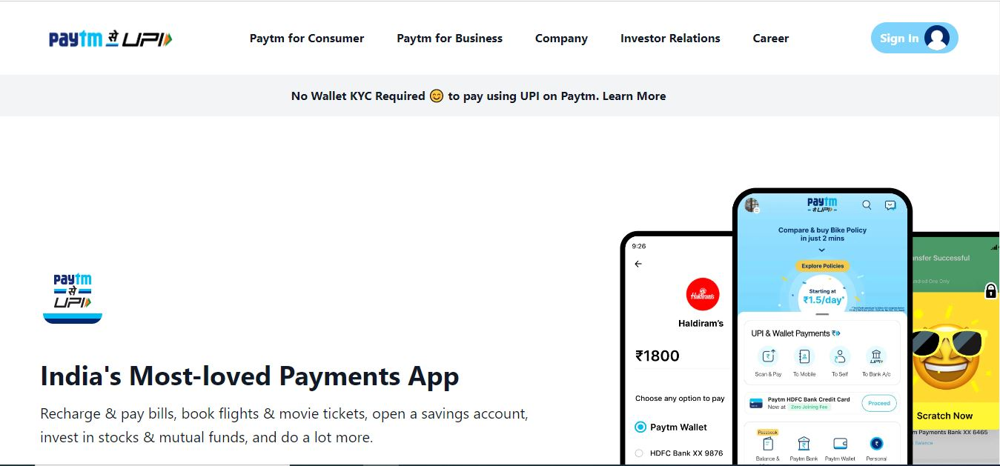

## Anurag Pathak

# Paytm responcive website

> Project 16

<table>
<tr>
<td>
  This is the Paytm mobile website. I have used two technologies in this website  to making the fully responcive for mobile view as well destop.
  These are the technology which have used - HTML, TAILWIND CSS

</td>
</tr>
</table>

### Skills Gained from this

- Navbar using CSS flexbox.
- Wrote HTML code from scratch for this project.
- Used Tailwind css class
- Class, tag selector for HTML elements.
- Created cards for displaying contents in better formats.
- gridbox

### Screenshot

## Time taken
6 to 7 hours.
